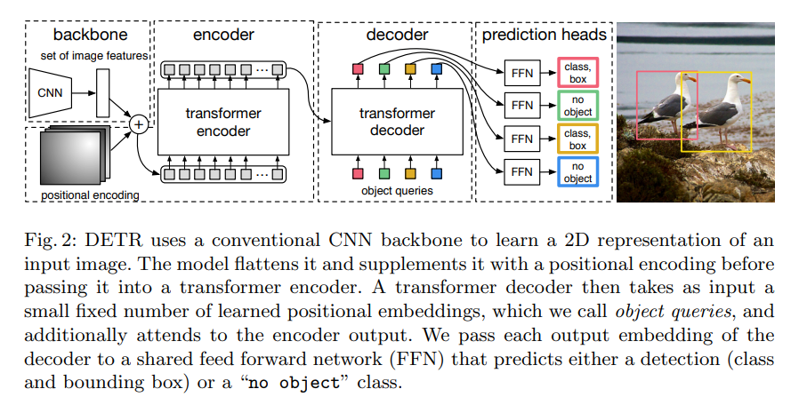
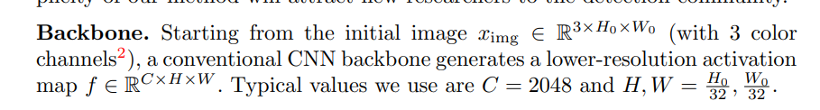
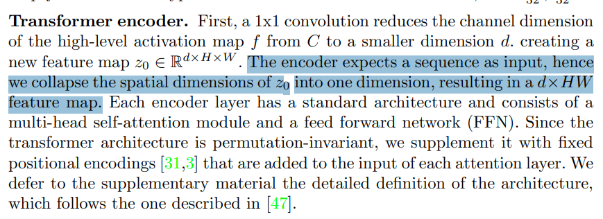
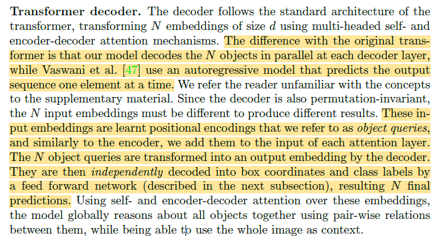
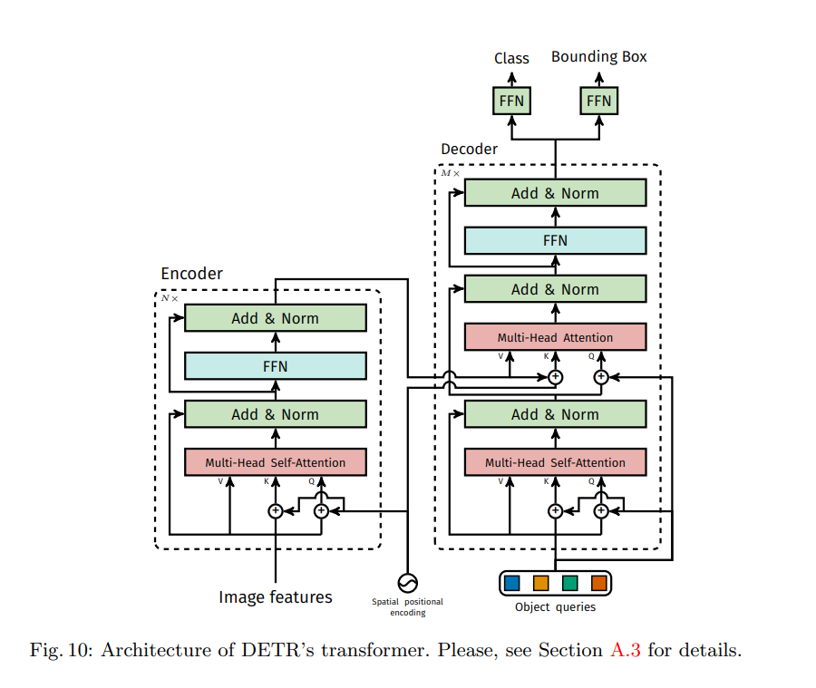
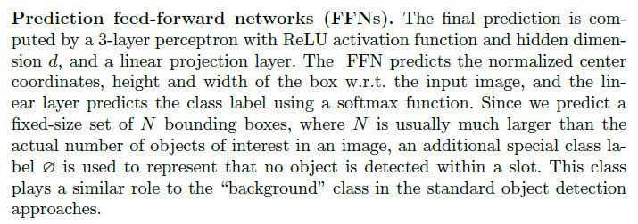
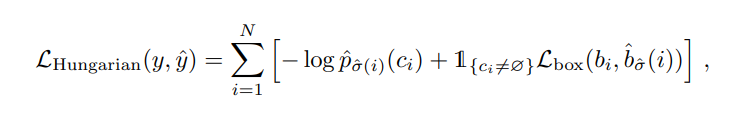
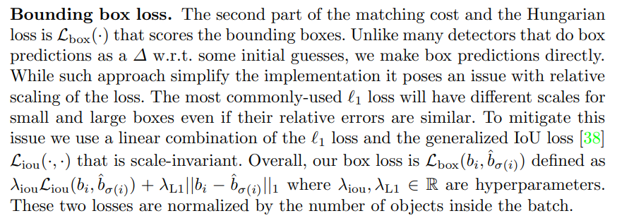

# DETR: End-to-End Object Detection with Transformers

## Implementation Details

### Feature extractor:

### Transformer Encoder and Decoder:

### Decoding Head

## Losses

### Data association
The hugarian algorithms is used to associate the pred and GT by minmizing the distance betwee them.

## Total Loss

Classification loss: Cross entropy loss
Regression loss: L1 loss + GIoU loss

